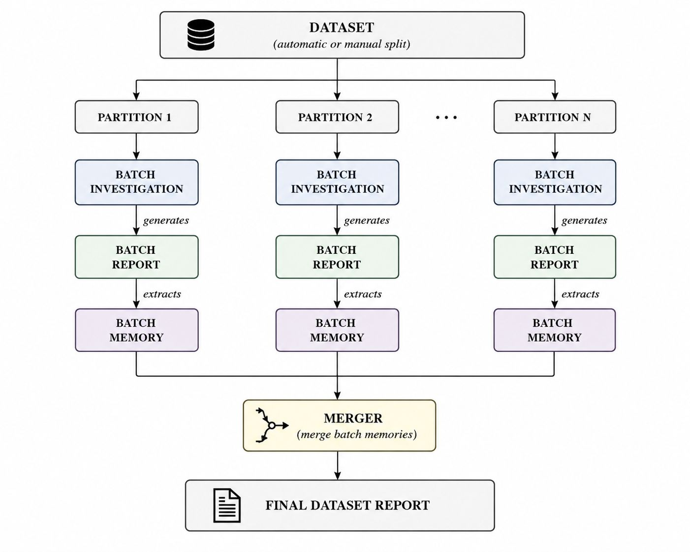
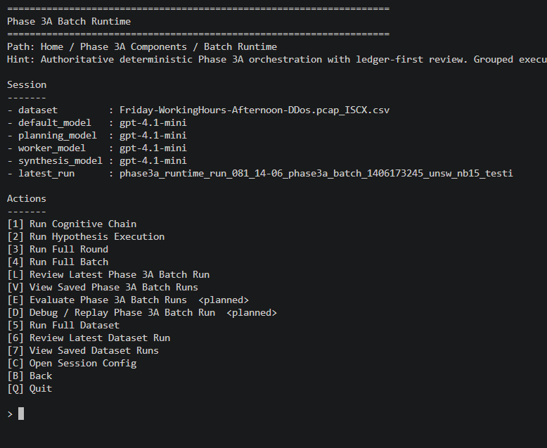
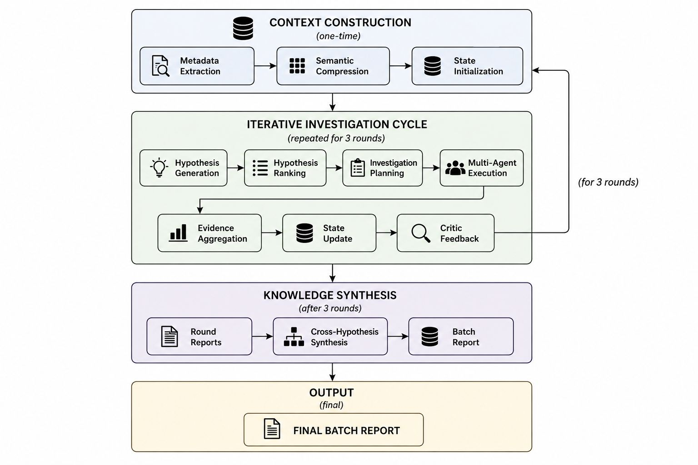
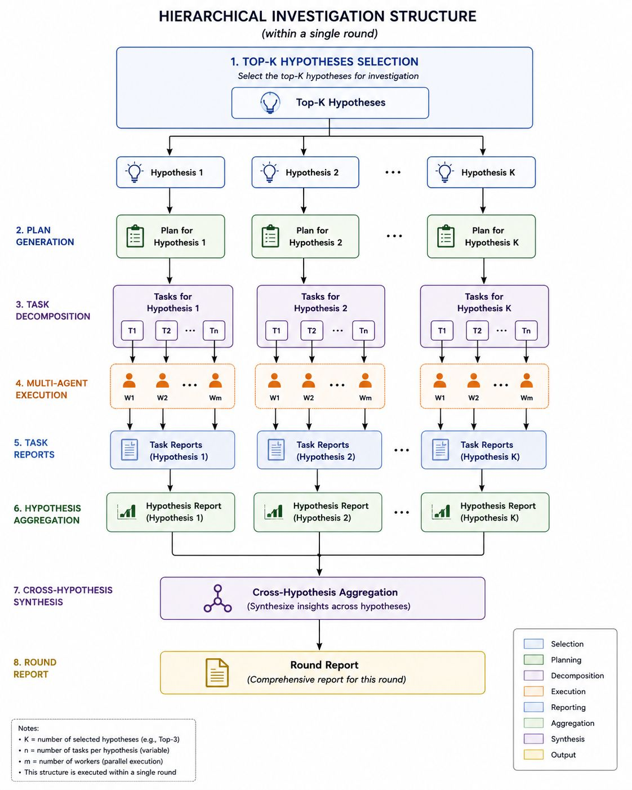
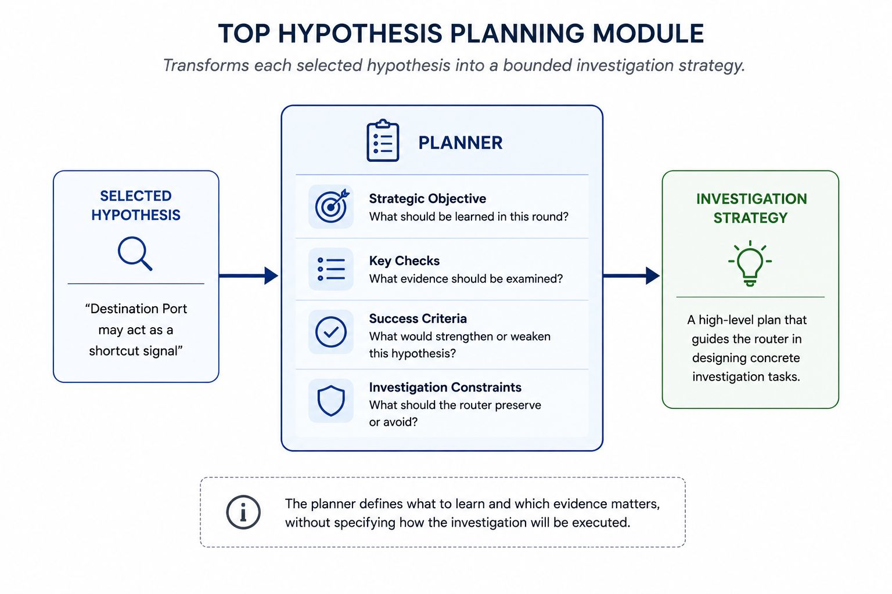
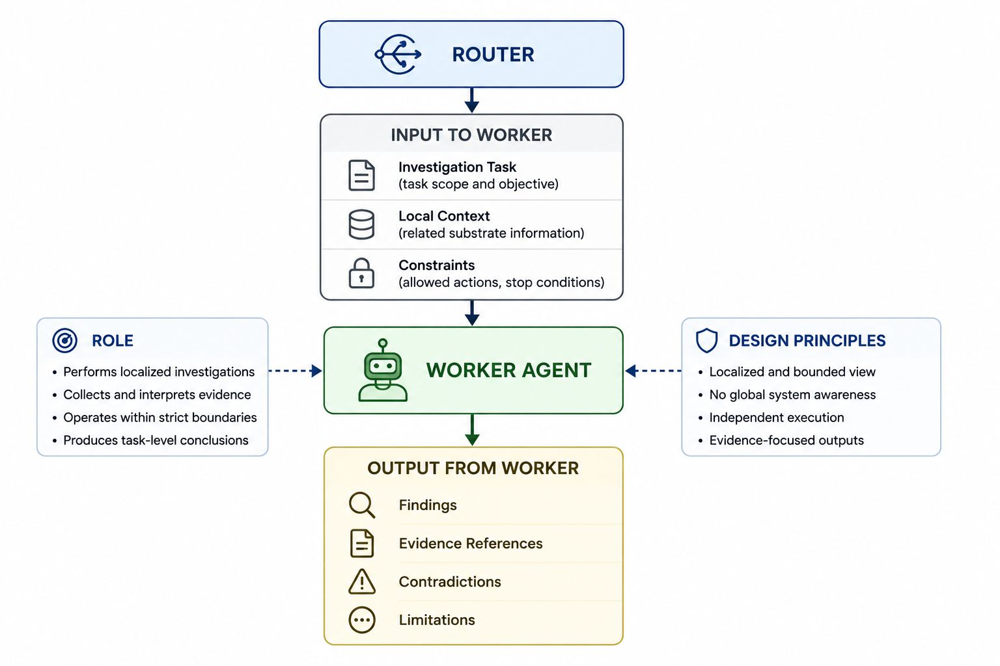
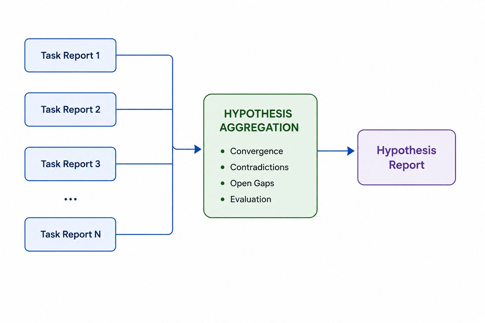

# NIDS Smell Audit — AI-Driven Dataset Integrity Auditing for Network Intrusion Detection

[](https://www.python.org/)
[](https://creativecommons.org/licenses/by-nc-nd/4.0/)

A modular LLM-agent framework for systematically auditing Network Intrusion Detection System (NIDS) datasets for design artefacts — including **shortcut learning**, **feature redundancy**, **data duplication**, **distributional anomalies**, and other spurious correlations that compromise model evaluation.

---

## Table of Contents

- [Overview](#overview)
- [Key Features](#key-features)
- [Architecture Overview](#architecture-overview)
- [Investigation Workflow](#investigation-workflow)
- [Execution Hierarchy](#execution-hierarchy)
- [Installation](#installation)
- [Requirements](#requirements)
- [Running the Framework](#running-the-framework)
- [CLI Usage](#cli-usage)
- [Evaluation](#evaluation)
- [Testing](#testing)
- [Repository Structure](#repository-structure)
- [Limitations](#limitations)
- [Future Work](#future-work)
- [Citation](#citation)

---

## Overview

Modern NIDS evaluation datasets (e.g., CIC-IDS2017, UNSW-NB15) frequently contain unintentional **design artefacts** — systematic biases introduced during data collection, label assignment, or feature engineering. These artefacts allow classifiers to achieve inflated performance by learning spurious correlations rather than genuine attack patterns, a phenomenon known as *shortcut learning*.

This framework addresses the following problem:

> **How can we systematically audit a NIDS dataset to identify, characterize, and report potential design artefacts in a reproducible, evidence-based manner?**

The framework employs a **multi-agent LLM architecture** that:

1. **Generates hypotheses** about potential artefacts based on dataset properties.
2. **Plans investigations** by decomposing hypotheses into concrete, executable tasks.
3. **Executes those tasks** using a combination of statistical analysis, heuristic checks, and LLM-driven reasoning.
4. **Aggregates findings** across multiple hypotheses, investigations, and rounds.
5. **Produces structured reports** with evidence, severity ratings, and reproducibility metadata.

The project was developed as part of a Bachelor's Thesis at the *Universitat Politècnica de Catalunya (UPC)*.

---

## Key Features

- **Hypothesis-Driven Auditing** — Automatically generates and ranks hypotheses about potential dataset artefacts, guiding the investigation toward the most promising leads.
- **Multi-Agent Orchestration** — Specialized LLM agents handle planning, routing, execution, criticism, aggregation, and synthesis.
- **ReAct Execution Strategy** — Workers combine reasoning and tool-use in a ReAct loop to gather evidence and validate claims.
- **Cross-Dataset Analysis** — Supports CIC-IDS2017 and UNSW-NB15 datasets, with an extensible configuration system.
- **Multi-Modal Execution** — Supports single-run and batch (multi-round) investigation modes.
- **Critic Feedback Loop** — A dedicated critic agent reviews findings for consistency, completeness, and evidential support.
- **Evidence Management** — Structured evidence projection, contradiction detection, and uncertainty quantification.
- **Reproducibility Infrastructure** — Comprehensive logging, run IDs, seed control, and trace capture for full experiment reproducibility.
- **Final Batch Auditor** — Synthesizes all round-level findings into a consolidated final report with reproducibility tracking.
- **CLI Tooling** — Full command-line interface for component-wise and end-to-end execution.

---

## Architecture Overview

The framework follows a **layered micro-architecture** organized around phases of investigation.



*Figure 1: High-level architecture showing the relationship between components, datasets, and the LLM backend.*

### Core Components

| Component | Responsibility |
|-----------|---------------|
| **Semantic Extraction** | Extracts semantic metadata from dataset partitions (feature types, distributions, correlations). |
| **Investigation Analysis** | Analyzes extracted metadata to identify potential artefact patterns. |
| **Hypothesis Ranking** | Ranks generated hypotheses by expected impact, confidence, and novelty. |
| **Planner** | Decomposes each hypothesis into a sequence of concrete investigation tasks. |
| **Router** | Routes tasks to appropriate worker agents based on task type and data requirements. |
| **Worker** | Executes individual tasks using a ReAct loop with tool access (statistical tests, data queries, code execution). |
| **Aggregation** | Aggregates worker findings across tasks within a single investigation round. |
| **State Manager** | Manages persistent state across rounds, including evidence, hypotheses, and resolved contradictions. |
| **Critic** | Reviews aggregated findings for logical consistency, evidential support, and completeness. |
| **Final Batch Auditor** | Synthesizes all findings across rounds into a final authoritative report with reproducibility metadata. |

### Run Modalities

The framework supports two execution modalities:



- **Single Run (`main`)**: A self-contained MVP execution that processes one dataset partition through the full pipeline once.
- **Batch Run (`main_phase3a_batch`)**: A multi-round investigation that iteratively refines hypotheses, executes tasks, and synthesizes findings across rounds.

---

## Investigation Workflow

The end-to-end investigation follows this sequence:



*Figure 2: Batch investigation workflow showing the round-level iteration and synthesis pipeline.*

1. **Partition Selection** — A dataset partition (e.g., a weekday CSV from CIC-IDS2017) is selected for auditing.
2. **Metadata Extraction** — Semantic extraction and investigation analysis components process the partition to produce feature-level metadata.
3. **Hypothesis Generation** — Potential artefact hypotheses are generated from metadata patterns.
4. **Hypothesis Ranking** — Hypotheses are ranked by expected impact and confidence.
5. **Per-Round Execution** — For each round:
   - **Planning**: Each hypothesis is decomposed into tasks.
   - **Routing**: Tasks are assigned to workers.
   - **Execution**: Workers execute tasks, gathering evidence.
   - **Aggregation**: Findings are aggregated.
   - **Critique**: Findings are reviewed for quality.
6. **Final Synthesis** — The final batch auditor produces a consolidated report.



*Figure 3: Detailed view of a single round's internal execution flow.*

---

## Execution Hierarchy

The framework operates at multiple levels of abstraction:

### 1. Hypotheses

A hypothesis is a testable claim about a potential design artefact. Examples:

- *"The `Flow Duration` feature exhibits near-zero variance within attack classes, suggesting it is a shortcut feature."*
- *"The `Bwd Packet Length Std` feature is highly correlated with `Fwd Packet Length Std`, indicating redundancy."*
- *"Duplicate rows exist across normal and attack partitions, potentially leaking labels."*

### 2. Planning

The Planner decomposes each hypothesis into a directed acyclic graph (DAG) of investigation tasks:



*Figure 4: Hypothesis decomposition into a structured investigation plan.*

### 3. Task Decomposition

Each leaf task in the plan is a concrete, self-contained unit of investigation:

- *"Compute the Gini impurity of Flow Duration across attack vs. normal samples."*
- *"Run a chi-squared test of independence between Bwd Packet Length Std and the label column."*
- *"Identify exact duplicate rows and measure their class distribution."*

### 4. Worker Execution

Workers execute tasks using a **ReAct (Reasoning + Acting)** loop:



*Figure 5: Worker execution loop combining reasoning, tool selection, and evidence gathering.*

Each worker:
1. Receives a task description and relevant context.
2. Reasons about the approach using the LLM.
3. Selects and invokes tools (statistical tests, data analysis functions, visualization).
4. Collects evidence and produces a structured finding.
5. Optionally, re-enters the reasoning loop for iterative refinement.

### 5. Reporting

Individual workers produce structured findings with:
- **Claim**: The specific assertion being made.
- **Evidence**: Quantitative and qualitative support.
- **Severity**: An ordinal rating of the artefact's potential impact.
- **Confidence**: A probabilistic measure of evidential strength.

### 6. Aggregation

Findings from multiple workers within a round are aggregated and checked for:
- **Consistency**: Do findings agree or contradict each other?
- **Saturation**: Has the round exhausted the investigative value?
- **Coverage**: Are all hypotheses adequately addressed?

### 7. Synthesis

The final batch auditor produces a consolidated report that:
- Merges findings across all rounds.
- Tracks reproducibility across partitions.
- Provides an executive summary of all identified artefacts.



*Figure 6: Multi-round aggregation and synthesis pipeline.*

---

## Installation

### Prerequisites

- Python 3.10 or higher
- An OpenAI API key (for LLM-powered agents)
- Git

### Steps

```bash
# Clone the repository
git clone https://github.com/your-username/nids-smell-audit.git
cd nids-smell-audit

# Create and activate a virtual environment
python -m venv .venv
source .venv/bin/activate   # Linux/macOS
.venv\Scripts\activate      # Windows

# Install dependencies
pip install -r nids-smell-audit/Phase3/requirements.txt
```

### Environment Setup

Copy the example environment file and configure your API key:

```bash
cp nids-smell-audit/Phase3/.env.example nids-smell-audit/Phase3/.env
```

Edit `.env`:

```ini
OPENAI_API_KEY=sk-...
OPENAI_MODEL=gpt-4.1-mini
OPENAI_TEMPERATURE=0.0
```

---

## Requirements

### Core Dependencies

| Package | Version | Purpose |
|---------|---------|---------|
| `openai` | ≥1.75.0 | LLM API client |
| `pandas` | ≥3.0.0 | Data manipulation |
| `numpy` | ≥2.4.2 | Numerical computation |
| `scikit-learn` | ≥1.8.0 | Statistical tests and metrics |
| `scipy` | ≥1.17.0 | Scientific computing |
| `matplotlib` | ≥3.10.8 | Visualization |
| `python-dotenv` | ≥1.1.0 | Environment variable management |

Full dependencies are pinned in [`nids-smell-audit/Phase3/requirements.txt`](nids-smell-audit/Phase3/requirements.txt).

### Datasets

The framework expects CSV/TSV partitions organized under `nids-smell-audit/Phase3/data/`. Supported dataset formats:

- **CIC-IDS2017**: Partitioned by weekday (Monday through Friday), with separate files for different attack types.
- **UNSW-NB15**: Training and test set partitions.

Dataset configuration is handled automatically via `data/dataset_config.py` based on file naming conventions.

---

## Running the Framework

### Inputs

- A **dataset partition** (CSV file) placed in the `data/` directory.
- An **OpenAI API key** configured in `.env`.

### Configuration

Key environment variables:

| Variable | Default | Description |
|----------|---------|-------------|
| `NIDS_DATASET_PATH` | *(auto-discovered)* | Path to a specific dataset partition |
| `OPENAI_MODEL` | `gpt-4.1-mini` | LLM model for all agents |
| `OPENAI_TEMPERATURE` | `0.0` | Sampling temperature |
| `OPENAI_SEED` | *(none)* | Random seed for reproducibility |
| `NIDS_MAX_STEPS` | `10` | Max ReAct steps per worker |
| `PHASE3A_MAX_ROUNDS` | `3` | Max batch investigation rounds |
| `PHASE3A_EXECUTION_MODE` | `full_batch` | Execution mode (`full_batch`, `dry_run`) |
| `PHASE3A_ENABLE_CRITIC` | `0` | Enable critic agent (set to `1`) |

### Execution Commands

#### Single Run (MVP)

Processes one dataset partition through the full pipeline once:

```bash
cd nids-smell-audit/Phase3
python main.py
```

#### Batch Run (Multi-Round)

Runs the full Phase 3A batch investigation pipeline with iterative refinement:

```bash
cd nids-smell-audit/Phase3
python -c "from main import main_phase3a_batch; main_phase3a_batch()"
```

Or via the CLI:

```bash
cd nids-smell-audit/Phase3
python -m phase3_runtime.orchestrator --mode full_batch
```

### Outputs

Outputs are generated in the following locations:

| Output | Location | Description |
|--------|----------|-------------|
| **Worker traces** | `logs/worker_runs/` | Per-worker execution traces with tool calls and reasoning |
| **Aggregation results** | `logs/aggregation_runs/` | Round-level aggregated findings |
| **Final reports** | `reports/` | Consolidated investigation reports |
| **Critic feedback** | `logs/critic_runs/` | Critic agent evaluations |
| **Runtime logs** | `logs/` | Component-level execution logs |

---

## CLI Usage

The framework provides CLI entry points for individual components, enabling granular control and debugging.

### `semantic-extraction`

Extract semantic metadata from a dataset partition.

```bash
python -m semantic_extraction.cli --dataset path/to/partition.csv
```

**Arguments:**

| Argument | Required | Description |
|----------|----------|-------------|
| `--dataset`, `-d` | Yes | Path to the dataset CSV file |
| `--output`, `-o` | No | Output JSON path (default: stdout) |
| `--config`, `-c` | No | Dataset configuration override |

### `investigation-analysis`

Analyze extracted metadata for artefact patterns.

```bash
python -m investigation_analysis.cli --metadata metadata.json
```

**Arguments:**

| Argument | Required | Description |
|----------|----------|-------------|
| `--metadata`, `-m` | Yes | Path to semantic extraction output |
| `--output`, `-o` | No | Output path for analysis results |

### `hypothesis-ranking`

Rank generated hypotheses by impact and confidence.

```bash
python -m hypothesis_ranking.cli --hypotheses hypotheses.json
```

**Arguments:**

| Argument | Required | Description |
|----------|----------|-------------|
| `--hypotheses`, `-h` | Yes | Path to candidate hypotheses JSON |
| `--output`, `-o` | No | Output path for ranked hypotheses |

### `planner`

Decompose a hypothesis into an investigation plan.

```bash
python -m planner.cli --hypothesis "Flow Duration exhibits shortcut behaviour"
```

**Arguments:**

| Argument | Required | Description |
|----------|----------|-------------|
| `--hypothesis`, `-y` | Yes | Hypothesis text |
| `--output`, `-o` | No | Output path for plan |

### `router`

Route tasks to appropriate execution logic.

```bash
python -m router.cli --task-list tasks.json
```

**Arguments:**

| Argument | Required | Description |
|----------|----------|-------------|
| `--task-list`, `-t` | Yes | JSON file with task definitions |
| `--output`, `-o` | No | Output path for routing assignments |

### `worker`

Execute a single investigation task.

```bash
python -m worker.cli --task task_definition.json --context context.json
```

**Arguments:**

| Argument | Required | Description |
|----------|----------|-------------|
| `--task`, `-t` | Yes | Task definition JSON file |
| `--context`, `-c` | Yes | Context/metadata JSON file |
| `--output`, `-o` | No | Output path for worker findings |

### `aggregation`

Aggregate findings from multiple workers.

```bash
python -m aggregation.cli --findings findings_dir/
```

**Arguments:**

| Argument | Required | Description |
|----------|----------|-------------|
| `--findings`, `-f` | Yes | Directory or JSON file with worker findings |
| `--output`, `-o` | No | Output path for aggregated results |

### `critic`

Review aggregated findings for consistency and quality.

```bash
python -m critic.cli --findings aggregated_results.json
```

**Arguments:**

| Argument | Required | Description |
|----------|----------|-------------|
| `--findings`, `-f` | Yes | Path to aggregated findings JSON |
| `--output`, `-o` | No | Output path for critic evaluation |

### `final-batch-auditor`

Synthesize all round-level findings into a final report.

```bash
python -m final_batch_auditor.cli --round-results rounds/
```

**Arguments:**

| Argument | Required | Description |
|----------|----------|-------------|
| `--round-results`, `-r` | Yes | Directory with round-level result files |
| `--output`, `-o` | No | Output path for final report |

### `state-manager`

Manage experiment state across rounds.

```bash
python -m state_manager.cli --action status
```

**Arguments:**

| Argument | Required | Description |
|----------|----------|-------------|
| `--action`, `-a` | Yes | Action: `status`, `save`, `load`, `reset` |
| `--state-file`, `-s` | No | Path to state file |

---

## Evaluation

The evaluation pipeline validates the framework's effectiveness at identifying known and novel dataset artefacts.

### Reproducing the Evaluation

```bash
cd nids-smell-audit/Phase3

# Run evaluation across all partitions
python -m evaluation.scripts.run_evaluation --datasets cic_ids_2017,UNSW_NB15
```

### Evaluation Components

| Component | What It Measures |
|-----------|-----------------|
| **Literature Recovery** | Whether the framework identifies artefacts previously documented in literature. |
| **Finding Reproducibility** | The consistency of findings across multiple runs with the same configuration. |
| **Hypothesis Stability** | Whether the same hypotheses are generated across runs and partitions. |
| **Artefact Coverage** | The breadth of artefact types the framework can detect (shortcut learning, duplication, redundancy, distributional anomalies). |
| **Cross-Dataset Generalization** | Performance consistency across CIC-IDS2017 and UNSW-NB15 datasets. |

### Evaluation Scripts

Utility scripts in `evaluation/scripts/` provide detailed analysis:

| Script | Purpose |
|--------|---------|
| `aggregate_metrics.py` | Aggregate evaluation metrics across runs |
| `extract_findings.py` | Extract and categorize findings from run logs |
| `extract_metrics.py` | Extract quantitative metrics from run outputs |
| `validate_corpus.py` | Validate findings against a literature corpus |

---

## Testing

The test suite covers unit, integration, and contract tests for all components.

### Running Tests

```bash
# Run all tests
pytest

# Run tests with verbose output
pytest -v

# Run tests for a specific component
pytest tests/test_prompt_builder.py -v
pytest tests/test_state_manager_status_transitions.py -v

# Run Phase 3 tests
pytest nids-smell-audit/Phase3/tests/ -v
```

### Test Structure

| Directory | Scope |
|-----------|-------|
| `tests/` | Root-level integration and contract tests |
| `nids-smell-audit/Phase3/tests/` | Component-specific unit and integration tests |
| `conftest.py` | Shared fixtures and test configuration |

Test configuration is managed via [`pytest.ini`](pytest.ini):

```ini
[pytest]
testpaths =
    tests
    nids-smell-audit/tests
```

---

## Repository Structure

```
.
├── .gitignore                     # Git exclusion rules
├── .gitignore (Phase3)           # Sub-project exclusion rules
├── README.md                      # This file
├── pytest.ini                     # Test configuration
├── conftest.py                    # Shared test fixtures
├── docs/
│   ├── images/                    # Documentation figures (copied from thesis)
│   └── architecture/              # Architecture documentation
├── tests/                         # Root-level integration tests
│   ├── test_dataset_runtime.py
│   ├── test_prompt_builder.py
│   ├── test_schema.py
│   ├── test_state_manager_*.py
│   ├── test_tools_evidence.py
│   └── ...
├── evaluation/
│   ├── scripts/                   # Evaluation scripts (tracked)
│   │   ├── aggregate_metrics.py
│   │   ├── extract_findings.py
│   │   ├── extract_metrics.py
│   │   └── validate_corpus.py
│   ├── README.md                  # Evaluation-specific README
│   └── ...                        # Generated outputs (gitignored)
├── nids-smell-audit/
│   ├── Phase3/
│   │   ├── main.py                # Entry point: single run
│   │   ├── config.py              # Global configuration
│   │   ├── requirements.txt       # Python dependencies
│   │   ├── .env.example           # Environment template
│   │   └── .gitignore             # Sub-project .gitignore
│   │   ├── agent/                 # Agent loop and orchestration
│   │   ├── aggregation/           # Finding aggregation
│   │   ├── critic/                # Critic agent
│   │   ├── data/                  # Dataset configurations
│   │   ├── dataset_runtime/       # Dataset loading and runtime
│   │   ├── final_batch_auditor/   # Final report synthesis
│   │   ├── final_batch_report/    # Report generation
│   │   ├── hypothesis_ranking/    # Hypothesis ranking
│   │   ├── investigation_analysis/# Metadata analysis
│   │   ├── judge/                 # Judging evaluator
│   │   ├── logs/                  # Execution logs (gitignored)
│   │   ├── phase3_runtime/        # Batch runtime orchestrator
│   │   ├── planner/               # Task planner
│   │   ├── prompts/               # LLM prompt templates
│   │   ├── reports/               # Generated reports (gitignored)
│   │   ├── router/                # Task router
│   │   ├── semantic_extraction/   # Metadata extraction
│   │   ├── src/                   # Shared source utilities
│   │   ├── state/                 # State schema and store
│   │   ├── state_manager/         # State management
│   │   ├── tests/                 # Component tests
│   │   ├── tools/                 # Worker tools registry
│   │   ├── utils/                 # Utility functions
│   │   ├── validation_repair_engine/ # Validation tools
│   │   └── worker/                # Worker agent
│   └── notes/                     # Agent notes
└── final_dataset/                 # Dataset artifacts (gitignored)
```

Note: `Thesis_reports/` contains the thesis source files and is **not tracked** in the main repository (separate deliverable).

---

## Limitations

1. **LLM Dependency** — The framework's reasoning quality is inherently tied to the underlying LLM. Different models (or model versions) may produce varying results. We recommend using a consistent model version for reproducibility.

2. **Cost** — Batch investigations with multiple rounds and concurrent workers can incur significant API costs, particularly when using larger models for planning and synthesis.

3. **Dataset Format Constraints** — The framework currently supports CSV/TSV formats with specific column naming conventions. Custom dataset formats require configuration updates in `data/dataset_config.py`.

4. **Shortcut Detection Scope** — While the framework excels at identifying statistical and distributional artefacts, it does not currently detect concept drift, temporal leakage, or causal violations that may require domain-specific knowledge.

5. **No Ground Truth** — The framework produces evidence-based findings, but there is no absolute ground truth for artefact identification. All findings should be validated by human domain experts before being used to inform dataset curation decisions.

6. **Single LLM Provider** — Currently hardcoded to OpenAI's API. Extending to other providers (Anthropic, open-source models) requires implementing new LLM callable adapters.

7. **Scalability** — The framework has been tested on partitions with up to ~2.8 million rows. Larger datasets may require additional optimization for memory and API throughput.

---

## Future Work

1. **Multi-Provider LLM Support** — Abstract the LLM interface to support multiple providers (Anthropic Claude, open-source models via vLLM/Ollama), enabling cost-performance trade-offs.

2. **Causal Discovery Integration** — Incorporate causal structure learning algorithms (PC, FCI, NOTEARS) to detect causal violations and data generation artefacts.

3. **Interactive Investigation Mode** — Allow human-in-the-loop intervention to guide hypothesis selection, approve plans, and validate findings interactively.

4. **Automated Dataset Repair** — Extend beyond detection to suggest and optionally apply automated repairs (e.g., removing duplicate rows, re-weighting features, suggesting confounders).

5. **Benchmark Suite** — Create a standardized benchmark of datasets with known injected artefacts to systematically evaluate detection performance.

6. **Web Dashboard** — Develop a web-based dashboard for exploring findings, visualizing artefact distributions, and comparing runs across datasets.

7. **Concept Drift Detection** — Add temporal analysis capabilities to detect concept drift in streaming or time-series partitioned datasets.

8. **Reproducibility Improvements** — Implement opt-in containerized execution (Docker/Singularity) for fully deterministic runtime environments.

---

## Citation

If you use this framework in your research, please cite:

```bibtex
@thesis{campillo2025,
  author       = {Campillo, Marc},
  title        = {Auditing NIDS Datasets Using LLM Agents},
  school       = {Universitat Politècnica de Catalunya (UPC)},
  year         = {2025},
  type         = {Bachelor's Thesis}
}
```

---

## License

This work is licensed under a [Creative Commons Attribution-NonCommercial-NoDerivatives 4.0 International License](https://creativecommons.org/licenses/by-nc-nd/4.0/).

---

## Acknowledgments

- Developed as a Bachelor's Thesis at the Universitat Politècnica de Catalunya (UPC).
- Built on open-source tools: Python, pandas, scikit-learn, matplotlib, and the OpenAI API.